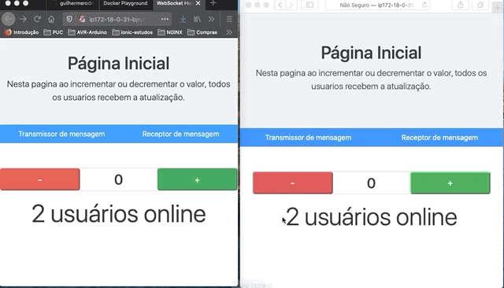

# Rodando a aplicação no Docker Playground [Play with Docker][play_with_docker]

Acesse o [Play with Docker][play_with_docker] e faca o login na sua conta do Docker.  
Após o Login bem sucedido, clique no botão **Start**  
Adicione uma nova instacia do Alpine Linux clicando no botao **+ADD NEW INSTANCE**  
Na maquina virtual que se iniciou, clone o repositorio do projeto dentro dela.  
```sh
# Clone do projeto para pasta app
git clone https://github.com/guilhermerodrigues680/websocket-python-html.git app
```
Acesse a pasta do projeto e suba os conteiners da aplicação com o Docker Compose  
```sh
# Acessando a pasta da aplicacao
cd app
# Subindo a aplicacao com o Docker Compose
docker-compose up
```
Após esses passos a os containers da aplicação estarão em execuçao na maquina virtual  
Em frente ao IP Local da maquina virtual, é possivel visualizar as portas que se abriram 
na maquina virtual, basta clicar sobre elas para ter acesso aos servicos.  
- A porta 6789 -> Backend da aplicação
- A porta 8080 -> Frontend da aplicação

Para encerrar a execucao do container, presssione `Ctrl + C` e em seguida clique no botao CLOSE SESSION.

### Capturas de tela (GIFs)

#### Clonando o repositorio e subindo o container da aplicação


  

#### Aplicacação




# Executando a aplicaçao localmente

Acesse o arquivo **src/html/js/config.js** e altere a veriável `PLAY_WITH_DOCKER` para `false`

<!-- Referencia de links -->
[play_with_docker]: https://labs.play-with-docker.com/
[this_repository]: https://github.com/guilhermerodrigues680/websocket-python-html.git
